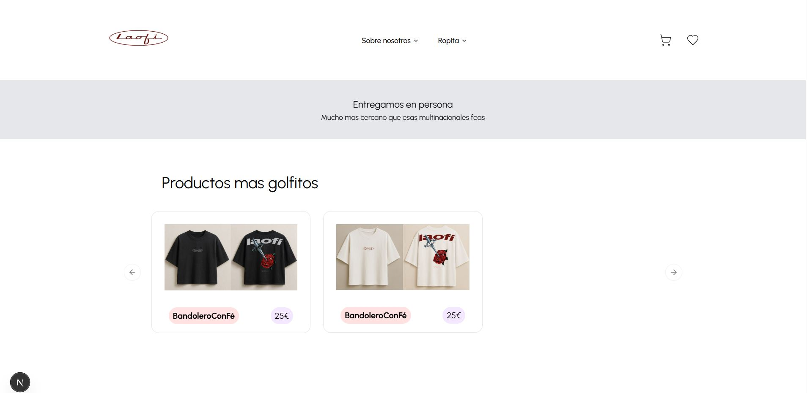
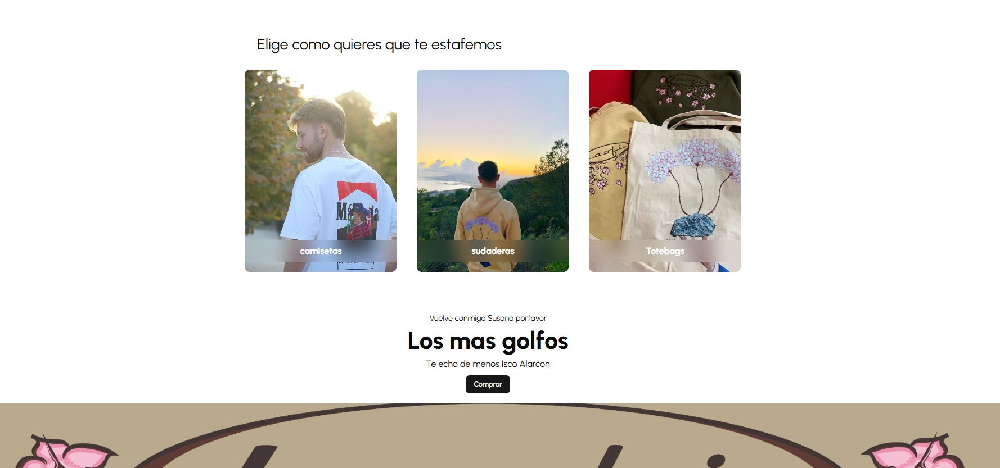
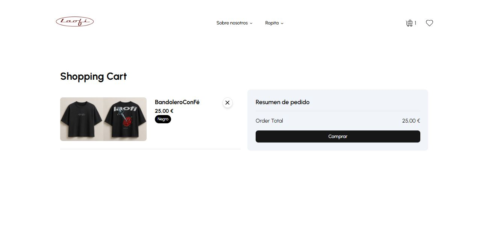

# 🛍️ Proyecto eCommerce (FRONTEND) - Marca de Ropa

Este repositorio contiene el desarrollo de una tienda online para una marca de ropa independiente creada por unos amigos. El objetivo de este proyecto es construir una plataforma moderna, escalable y fácil de usar para vender ropa en línea.

🚧 **Estado del proyecto: EN DESARROLLO**  
La estructura está completamente montada (frontend, backend y base de datos), pero aún faltan añadir las fotos y productos finales de la tienda.

---

## 🧱 Tecnologías utilizadas

- **Frontend**: React  
- **Estilos**: Tailwind CSS  
- **Estado global**: Zustand  
- **Backend (CMS)**: Strapi  
- **Base de datos**: PostgreSQL

---

## ✨ Funcionalidades actuales

- [x] Página de inicio con diseño responsive  
- [x] Catálogo de productos (estructura lista, algunos productos de ejemplo)  
- [x] Carrito de compras con Zustand  
- [x] Panel de administración con Strapi  
- [x] Rutas públicas y protegidas  
- [x] Conexión con base de datos PostgreSQL

---

## 🔜 Pendiente por implementar

- [ ] Subida de fotos oficiales de los productos  
- [ ] Carga completa de catálogo  
- [ ] Pasarela de pagos (Stripe o PayPal)  
- [ ] Página de contacto  
- [ ] Pruebas de usabilidad  
- [ ] Mejoras de SEO y rendimiento

---

### Header

### Tail

### Carrito 

### Descripcion de producto 

